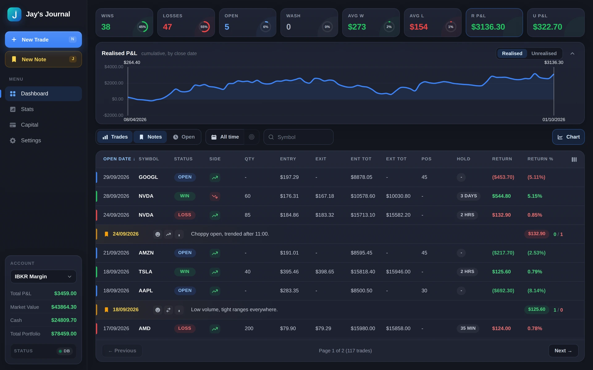
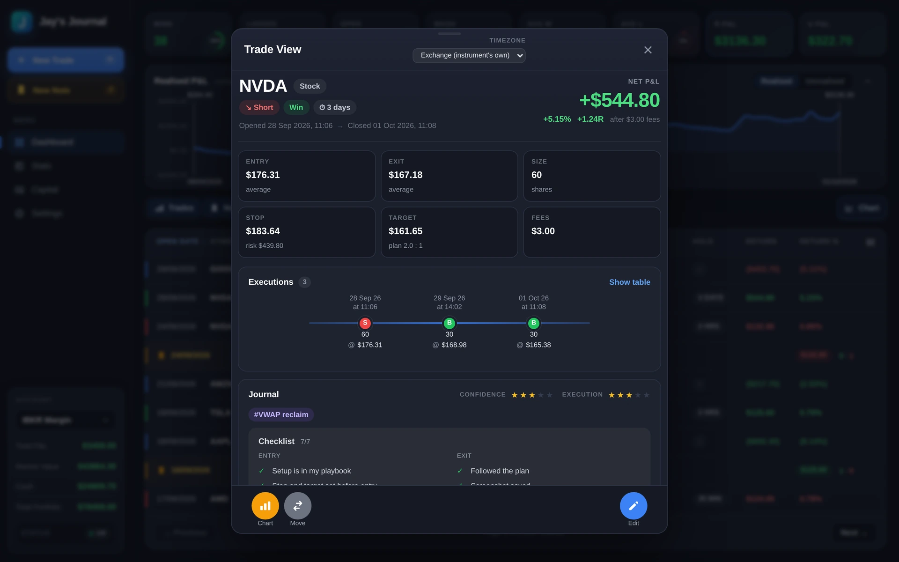
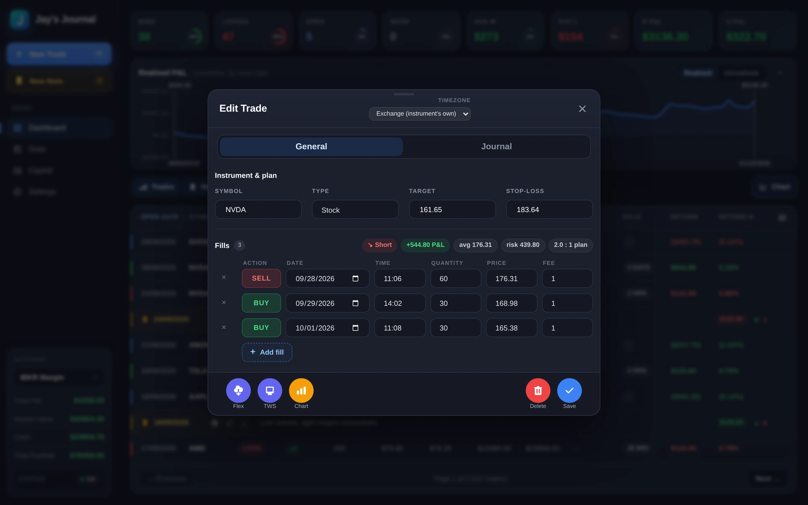
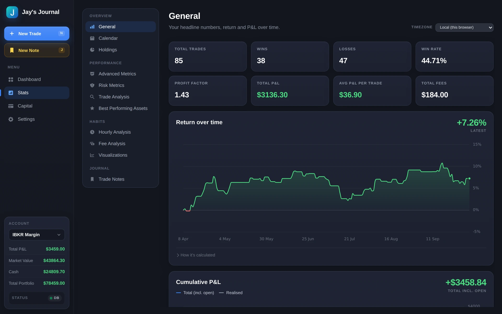
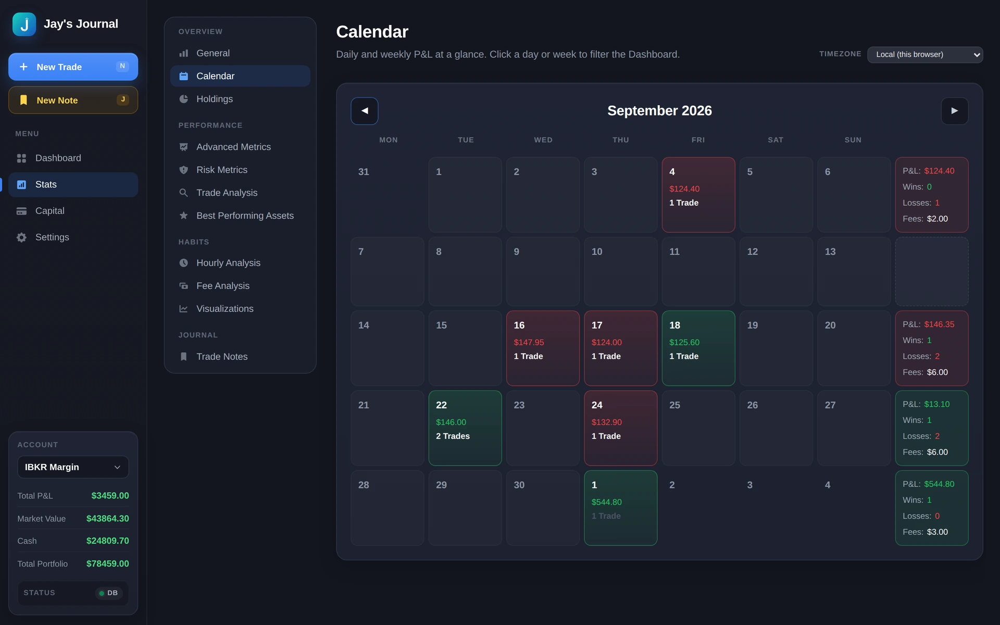
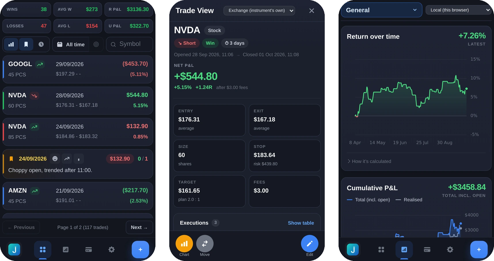

# Jay's Journal

A self-hosted trading journal for stocks and futures. Vibe coded. Log trades and daily notes, chart them against real historical price data pulled from **Interactive Brokers (TWS/Flex Web Service)** and **Yahoo Finance**, and get PnL, R-multiple, streak, and other performance stats computed automatically.

Everything runs on your own machine/server against your own PostgreSQL database — no third-party account required beyond IBKR (optional) and Yahoo (used automatically, no account needed).

**It has no login or any other security features.** Securing the journal and its database is up to you — see [Security](#security).

<p align="center">
  
</p>

## Features

- Trade log with FIFO PnL/return/R-multiple calculation, per-account column visibility, screenshots
- Tags in groups (setup, mistake, market…, your own): a tag filter on the Dashboard and win rate and P&L per tag in Stats
- Daily journal notes (mood, market condition, summary) alongside trades
- Historical price charts per symbol, timeframe-configurable per instrument, backed by a local Postgres cache
  - Yahoo Finance as a fast/always-available source; IBKR TWS as a higher-quality source that supersedes it where available
  - Each enabled timeframe is fetched as far back as the provider actually allows — Yahoo's limits are known in advance, IBKR's are discovered automatically and cached so the app doesn't keep re-requesting data that doesn't exist
  - Futures continuous contracts built automatically from individual IBKR contracts, with rollover detection
- Stats dashboard: win rate, expectancy, Sharpe/Sortino, streaks, hourly/day-of-week breakdowns, return distribution
- IBKR Flex Web Service import for reconciling trade activity/executions
- A [read/write external API](EXTERNAL_API.md) for feeding your data into another tool (e.g. an LLM-based trade analyzer) — no auth by design, see that doc before exposing it beyond localhost
- Multi-currency: each symbol has its own currency, and money is shown per currency, never blended

## Screenshots

<table>
  <tr>
    <td width="50%"><br><sub><b>Trade view</b>: P&L and R-multiple at a glance, every fill on a timeline, journal, ratings and checklist.</sub></td>
    <td width="50%"><br><sub><b>Trade entry</b>: fills with a live summary of side, P&L, average price, risk and planned reward.</sub></td>
  </tr>
  <tr>
    <td width="50%"><br><sub><b>Stats</b>: headline numbers, return over time and cumulative P&L, plus a dozen more sections.</sub></td>
    <td width="50%"><br><sub><b>Calendar</b>: daily and weekly P&L. Click a day or week to filter the Dashboard.</sub></td>
  </tr>
</table>

Works on phones too:

<p align="center">
  
</p>

<sub>Screenshots show generated demo data.</sub>

## Stack

- **Frontend**: React 18 (Create React App, built via [CRACO](https://craco.js.org/) — not Vite)
- **Backend**: Node/Express (`server.js`, `routes/`, `modules/`)
- **Database**: PostgreSQL — schema is created and migrated automatically on startup, no manual SQL needed
- **Market data**: [`@stoqey/ib`](https://github.com/stoqey/ib) for IBKR TWS, [`yahoo-finance2`](https://github.com/gadicc/node-yahoo-finance2) for Yahoo

## Quick start

See **[docs/SETUP.md](docs/SETUP.md)** for the full walkthrough (Docker, manual/dev setup, PostgreSQL, IBKR TWS and Flex Web Service configuration).

The short version:

```bash
docker build -t jjournal .
docker run -d \
  --restart unless-stopped \
  -p 3999:3999 \
  -v jjournal_data:/user_data \
  --name jjournal \
  jjournal
```

`--restart unless-stopped` matters: changing the database URL or port in Settings restarts the app by exiting the process, and Docker only brings it back up with a restart policy.

Then open `http://localhost:3999`, go to **Settings**, and paste in a PostgreSQL connection string — the app creates its own schema on connect. Everything else (IBKR address, Flex Web Service token, which symbols/timeframes to track) is configured from the same Settings page.

## Requirements

- A reachable PostgreSQL database (the app only needs an empty database + a user with create-table privileges; it manages its own schema)
- Node.js 22+ if running outside Docker
- **Optional**: IBKR TWS or IB Gateway running with the API enabled, if you want IBKR-quality historical data and Flex Web Service imports. Without it, the app still works fully off Yahoo Finance data.

## Data & persistence

If running via Docker, mount `/user_data` (holds `config.json` and log files) as a volume, and point `databaseUrl` at a Postgres instance you're backing up separately — the database itself isn't stored in the container. Trade/day-note screenshots are stored in the database too; the app's `Uploads/` directory only holds upload temp files.

## Security

The journal has no login, user accounts or any other access control, and the [external API](EXTERNAL_API.md) has no authentication either: anyone who can reach its address can read and change all your trades and notes, and change its settings (database connection, IBKR access). Securing the journal and the database is the responsibility of whoever runs it. For most people, running it on the home network (LAN) only, without exposing it to the internet, is probably good enough. To reach it from outside, put it behind a VPN or a reverse proxy that asks for a login, rather than opening a port to it.

## Disclaimer

This software is provided **as is**, with **no warranty of any kind** and **no liability accepted** for any damages or losses arising from its use — see [LICENSE](LICENSE) for the full terms. It computes PnL, returns, and other stats for your own reference only; this is not financial advice, and you're solely responsible for independently verifying any numbers before relying on them for trading or tax purposes.

## Contributing

Bug fixes and features are welcome — see [CONTRIBUTING.md](CONTRIBUTING.md).

## License

[PolyForm Noncommercial 1.0.0](LICENSE) — free to use, modify, and redistribute for any non-commercial purpose. Commercial use requires the author's consent.
